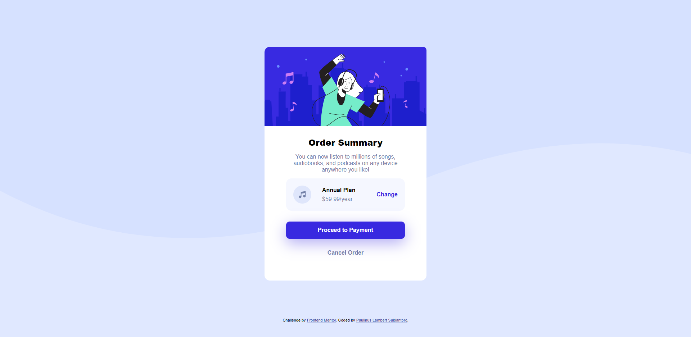

# Frontend Mentor - Order summary card solution

This is a solution to the [Order summary card challenge on Frontend Mentor](https://www.frontendmentor.io/challenges/order-summary-component-QlPmajDUj). Frontend Mentor challenges help you improve your coding skills by building realistic projects.

## Table of contents

- [Overview](#overview)
  - [The challenge](#the-challenge)
  - [Screenshot](#screenshot)
  - [Links](#links)
- [My process](#my-process)
  - [Built with](#built-with)
  - [What I learned](#what-i-learned)
  - [Continued development](#continued-development)
- [Author](#author)

## Overview

### The challenge

Users should be able to:

- See hover states for interactive elements

### Screenshot



### Links

- Solution URL: [Responsive Order Summary Card using CSS only](https://www.frontendmentor.io/solutions/responsive-order-summary-card-using-css-only-H8y7yoB6c)
- Live Site URL: [Order Summary Component](https://lambert18.github.io/Order-summary-component/)

## My process

### Built with

- Semantic HTML5 markup
- CSS custom properties

### What I learned

My first time using border to make a button without tag button.

```css
.btn {
  font-weight: 700;
  position: relative;
  width: 300px;
  height: auto;
  padding: 15px;
  margin: 0 auto;
  background-color: var(--bright_blue);
  color: white;
  border-radius: 10px;
  cursor: pointer;
  box-shadow: 0 12px 40px hsla(245, 75%, 52%, 0.4);
}
```

### Continued development

In the future I will make improvements to the CSS part, because I only use the simplest Properties and it's still very messy, so I need to learn more and continue this development again.

## Author

- Website - [www.paulinuslambert.com](https://paulinuslambert.com/)
- Frontend Mentor - [@lambert18](https://www.frontendmentor.io/profile/lambert18)
- Twitter - [@park\_\_ul](https://twitter.com/park__ul)
